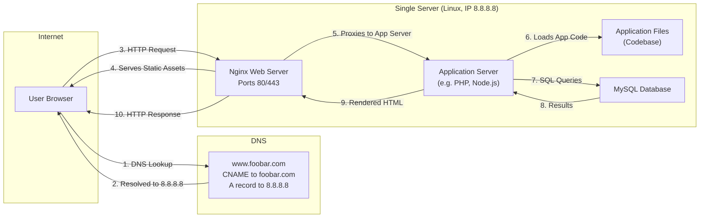

# Simple web stack

The user opend up a browser ans types ```www.foobar.com``` The browser first checks DNS to find the IP address of the server. The browser then sends a request to that server. On the server, a LAMP stack runs Linux as the OS, Apache as the web server, PHP to run the website code, and MySQL as the database. Apache handles the request and passes it to PHP, which may grab data from MySQL and build a web page. That page is sent back to the user’s browser to display the site. It all happens on one server, which makes it simple but not very scalable.

#  Design Infrastructure


# Infrastructure specifics

### What is a server?

A server is a computer network that provides services or resources to other computers (clients). In web infrastructure, servers can store web pages, run applications, handle requests, or manage data.

### Role of the domain name
A domain name is a human-readable address used to access websites being that is easier to remember than an normal IP address. When a user types it into a browser, the domain name is resolved to an IP address via DNS, which this tells the browser where to send the request.

### Type of DNS record for “www”
Its a record maps the hostname “www.foobar.com” directly to its IPv4 address (8.8.8.8).

### Role of the web server
Handles HTTP requests from users and serves static content or forwards requests to an application server for dynamic content.

### Role of the application server
Handles business logic, dynamic content, the web server forwards those requests to the app server to process and return a response.

### What is the role of the database?
Database like MySQL stores and organizes data. The application server queries the database to retrieve or update data based on user actions.

### Communication with the user’s computer
The server communicates using the HTTP or HTTPS protocol, which runs over TCP/IP ensuring a reliable and ordered delivery of requests and responses.

# Infrastructure issues
### Single Point of Failure (SPOF)

If there's only one server handling everything and it fails, the entire website becomes unavailable. 

### Downtime maintenance

If you need to restart the web or application server  the entire site may go down temporarily.

### Scalability

A single server has limited CPU, memory, bandwidth. If too many users visit at once it may slow down or crash and  it cannot scale to handle the load.
