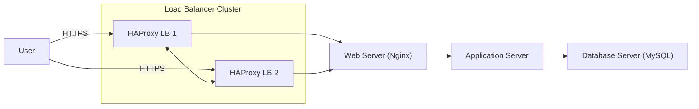

# Scale up

### Application server vs web server

### A web server
Is responsible for handling HTTP and HTTPS requests. It serves static content like HTML files, images, CSS, and JavaScript. When a request needs dynamic content, the web server forwards it to the application server.

### An application server
 Runs the backend code that powers the logic of your site or app. It processes dynamic requests, interacts with the database, and returns rendered responses to the web server.

# Design Infrastructure

# Infrastructure specifics

### Load Balancer Cluster

Using two HAProxy instances in a cluster to avoid having a single point of failure. If one load balancer goes down, the other can continue handling traffic. The cluster ensures high availability, distributes traffic between backend components, and handles SSL termination.

### Web Server

The web server runs on its own dedicated machine. It handles static content and forwards dynamic requests to the application server.
### Application Server

The application server runs the backend logic, processes requests, interacts with the database, and generates dynamic content. hosting this separately allows us to scale the app layer independently from the web layer, and keeps resource usage isolated.

### Database Server

The database is hosted on its own machine to avoid performance issues caused by sharing resources with the app or web server. It also simplifies the security, backups, and monitoring.
